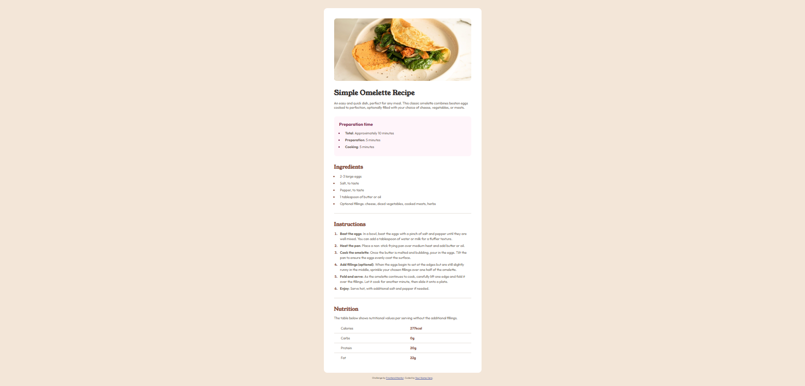

# Frontend Mentor - Recipe page solution

This is a solution to the [Recipe page challenge on Frontend Mentor](https://www.frontendmentor.io/challenges/recipe-page-KiTsR8QQKm). Frontend Mentor challenges help you improve your coding skills by building realistic projects.

## Table of contents

- [Overview](#overview)
  - [The challenge](#the-challenge)
  - [Screenshot](#screenshot)
  - [Links](#links)
- [My process](#my-process)
  - [Built with](#built-with)
  - [What I learned](#what-i-learned)
  - [Continued development](#continued-development)
- [Author](#author)

## Overview

### Screenshot



### Links

- Solution URL: [Add solution URL here](https://github.com/zzeeyyaa/fem-recipe-page)
- Live Site URL: [Add live site URL here](https://zzeeyyaa.github.io/fem-recipe-page/)

## My process

### Built with

- Semantic HTML5 markup (`<main>`, `<article>`, `<section>`, `<ol>`, `<table>`)
- CSS custom properties (Variables)
- Flexbox
- Fluid spacing using CSS `clamp()`
- Modern CSS `::marker` pseudo-element for custom list styling

### What I learned

In this project, I focused on writing clean, semantic HTML by structuring the recipe with dedicated `<section>` elements, using an ordered list (`<ol>`) for cooking instructions, and formatting the nutrition facts with a native `<table>`.

I also practiced using modern CSS features such as `::marker` to customize list bullet/number colors independently from the text, and `clamp()` for responsive layout padding.

````html
<section class="nutrition">
  <h2>Nutrition</h2>
  <p>
    The table below shows nutritional values per serving without the additional
    fillings.
  </p>
  <table>
    <tr>
      <th>Calories</th>
      <td>277kcal</td>
    </tr>
    <tr>
      <th>Carbs</th>
      <td>0g</td>
    </tr>
    <tr>
      <th>Protein</th>
      <td>20g</td>
    </tr>
    <tr>
      <th>Fat</th>
      <td>22g</td>
    </tr>
  </table>
</section>
``` ```css /* Custom bullet & number colors using ::marker */ .preparation-time
li::marker { color: var(--rose-800); } .instructions li::marker { color:
var(--brown-800); font-weight: 700; } /* Clean border collapse for table */
.nutrition table { width: 100%; border-collapse: collapse; } .nutrition tr {
border-bottom: 1px solid var(--stone-150); } .nutrition tr:last-child {
border-bottom: none; }
````

### Continued development

In upcoming projects, I want to continue refining:

- Advanced responsive layouts for multi-column structures using CSS Grid.
- Enhancing web accessibility (ARIA attributes and keyboard navigation).
- Working with complex responsive tables.

## Author

- Frontend Mentor - [@zia](https://www.frontendmentor.io/profile/zzeeyyaa)
